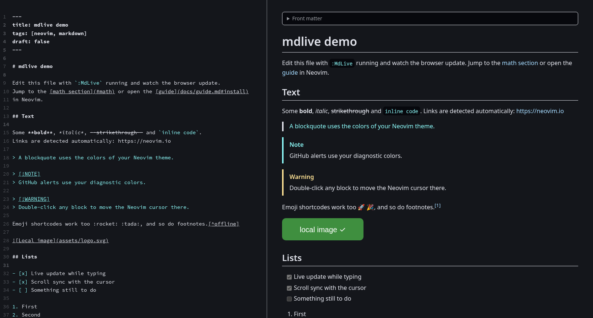

# mdlive

[](https://github.com/rafael0rueda/mdlive/actions/workflows/ci.yml)

Live browser preview of Markdown buffers. The preview updates while you type,
follows your cursor and uses the colors of your Neovim colorscheme.



- Pure Lua: the HTTP server runs inside Neovim (`vim.uv`), nothing to install
- Updates while typing (debounced), pushed with Server-Sent Events
- One tab follows you: switching to another markdown buffer switches the preview
- Scroll sync with the window and cursor, and double-click the preview to
  jump to the source line in Neovim
- An outline of the headings next to the preview, marking the section you are in
- Code highlighting (highlight.js) using your colorscheme's syntax colors,
  with line numbers and a copy button on code blocks
- Math with KaTeX (`$inline$` and `$$block$$`) and Mermaid diagrams
- Task lists you can tick in the preview: the click changes `[ ]` to `[x]` in the buffer
- Tables, heading anchors, footnotes, `:emoji:` shortcodes and
  relative images
- GitHub alerts (`> [!NOTE]`, `[!TIP]`, `[!WARNING]`, ...) in your diagnostic colors
- Export the preview to a standalone HTML file with `:MdLiveExport`
- Relative links: markdown files open in Neovim and the preview follows them;
  other files open in a new tab
- YAML (`---`) and TOML (`+++`) front matter shown as a collapsible block
- Works offline: all browser libraries are bundled in `app/vendor`

Requires Neovim 0.11+. Full documentation is in `:help mdlive`, and
`:checkhealth mdlive` checks your setup. Changes are listed in
[CHANGELOG.md](CHANGELOG.md).

## Installation

[lazy.nvim](https://github.com/folke/lazy.nvim):

```lua
{
  "rafael0rueda/mdlive",
  version = "*", -- the latest release; remove it to follow main
  ft = "markdown",
  cmd = { "MdLive", "MdLiveStop", "MdLiveToggle", "MdLiveExport" },
  opts = {},
}
```

Without a plugin manager, clone the latest release and add it to `runtimepath`:

```sh
git clone --branch v0.2.0 https://github.com/rafael0rueda/mdlive ~/.local/share/nvim/site/pack/plugins/start/mdlive
```

```lua
require("mdlive").setup()
```

Or from any directory:

```lua
vim.opt.rtp:prepend("/path/to/mdlive")
require("mdlive").setup()
```

## Usage

| Command                   | Action                                                            |
| ------------------------- | ----------------------------------------------------------------- |
| `:MdLive`                 | Start the preview and open it in the browser (reuses an open tab) |
| `:MdLiveStop`             | Stop the preview (in follow mode, from any buffer)                |
| `:MdLiveToggle`           | Toggle the preview                                                |
| `:MdLiveUrl`              | Show the preview URL and copy it to the clipboard                 |
| `:MdLiveExport[!] [file]` | Save the preview as HTML, next to the file by default (`!` overwrites) |

To get a PDF, print the preview from the browser.

mdlive maps no keys. Each command has a Normal mode mapping to bind to your own
keys: `<Plug>(MdLive)`, `<Plug>(MdLiveStop)`, `<Plug>(MdLiveToggle)`,
`<Plug>(MdLiveUrl)` and `<Plug>(MdLiveExport)`.

```lua
vim.keymap.set("n", "<leader>mp", "<Plug>(MdLiveToggle)", { desc = "Markdown preview" })
```

The same actions are available from Lua with `enable()`, `is_enabled()`,
`url()` and `export()`, see `:help mdlive-api`.

Try it with `examples/demo.md`.

## Configuration

`setup()` is optional; these are the defaults:

```lua
require("mdlive").setup({
  host = "127.0.0.1",   -- address the server binds to
  port = 0,             -- 0 = pick a free port
  file_root = nil,      -- nil = the working directory, when the file is inside it
  browser = nil,        -- nil = system default, "firefox", { "firefox", "--new-window" }, function(url) or false
  browser_redirect = true, -- keep the preview URL out of the process list (off for sandboxed browsers)
  debounce_ms = 150,    -- delay after the last edit before updating
  auto_open = false,    -- open the preview when a buffer of `filetypes` is opened
  filetypes = { "markdown" },
  follow = true,        -- one tab switches to the markdown buffer you are in
  scroll_sync = true,   -- scroll the preview with the cursor
  follow_theme = true,  -- use the Neovim colorscheme in the preview
  code_line_numbers = true, -- line numbers on code blocks with more than one line
  outline = false,      -- open the outline of the headings (the ☰ button toggles it)
})
```

## Remote use

When Neovim runs on another machine, forward the preview's port over SSH and
open it in your local browser:

```lua
-- On the remote machine: a fixed port, and no browser there.
require("mdlive").setup({ port = 8090, browser = false })
```

```sh
ssh -L 8090:127.0.0.1:8090 user@host
```

Then `:MdLive` and `:MdLiveUrl`, which shows the URL and copies it to your
clipboard in terminals that support OSC 52. See `:help mdlive-remote`.

## How it works

```
Neovim buffer --TextChanged/CursorMoved--> Lua HTTP server --SSE--> browser
```

The browser page (`app/`) renders the Markdown with markdown-it and patches the
DOM in place, so images and diagrams that did not change are not reloaded.
Highlighted code, formulas and diagrams are cached, and events that arrive
during a render are merged, so a 10,000-line document updates in about 0.1 s.
Every block carries its source line, which is how the cursor position maps to
a scroll position. Theme colors are read from highlight groups (`Normal`,
`@keyword`, `@string`, `@markup.heading.1`, ...) and sent again on
`ColorScheme`. `:MdLiveExport` asks the open tab for the rendered page, with
styles and fonts inlined, and Neovim writes it to disk.

## Security

Markdown files can contain raw HTML, so the preview treats them as untrusted,
for example a README in a repository you just cloned:

- HTML is sanitized with DOMPurify, and a Content-Security-Policy only allows
  the plugin's own scripts, so embedded scripts and event handlers never run.
  Attributes the page uses for its own features are removed from that HTML,
  so a web link cannot pose as a link that opens a file in Neovim.
- Images and linked files are served only from the Markdown file's directory
  and the current working directory, with a `sandbox` policy so an `.html` or
  `.svg` file cannot run scripts either. Symlinks are resolved before that
  check, so a link cannot point outside those directories.
- Preview URLs contain a random token, new each time the server starts. The
  page, its events, files and actions all need it, so other users or programs
  on the machine cannot read your buffers or files through the server. Files
  are only served for buffers that are being previewed.
- The server listens on `127.0.0.1` and rejects requests with a non-local
  `Host` header. Requests that act in Neovim (opening a linked file, moving
  the cursor, ticking a task, saving an export) need a same-origin request
  with a custom header, so other websites cannot trigger them.
- Exported HTML files include a Content-Security-Policy that blocks scripts
  wherever they are opened.

## Tests

[CONTRIBUTING.md](CONTRIBUTING.md) describes the layout, the checks and what
a change includes.

```sh
make check        # everything below
make test         # tests/smoke.lua
make browser      # tests/browser.mjs
make lint         # stylua --check (`make format` fixes it)
make typecheck    # Lua with lua-language-server, app/preview.js with TypeScript
make helptags
make vendor-check # app/vendor matches the pinned npm packages
```

`make tools` installs the stylua and lua-language-server versions CI uses
into `~/.local/bin` (`TOOLS=/other/prefix` to change it).

`tests/smoke.lua` checks the Neovim side: the server, its security checks and
what it sends. `tests/browser.mjs` opens the preview in headless Chrome against
a real Neovim and checks the page: rendering, sanitizing, in-place updates,
scroll sync, jumping to the source, export and reconnecting. It needs Node 22+
and Chrome or Chromium (set `CHROME=/path/to/chrome` if it is not on `PATH`),
and no packages.

CI runs the same targets: the smoke test on Neovim 0.11, stable and nightly,
and on macOS and Windows; the browser tests on Linux and macOS; checks that the
help tags in `doc/` build without errors and type checks the Lua code with
lua-language-server, using the types in `$VIMRUNTIME`.

## License

[MIT](LICENSE) © Rafael Rueda

### Bundled libraries

The browser libraries in `app/vendor` keep their own licenses, included in
`app/vendor/licenses`. The files are exactly what their npm packages contain;
`scripts/vendor.json` pins each package, and `make vendor` downloads them
again:

| Library             | Version | License               |
| ------------------- | ------- | --------------------- |
| markdown-it         | 15.0.2  | MIT                   |
| markdown-it-texmath | 1.0.0   | MIT                   |
| markdown-it-footnote | 4.0.0  | MIT                   |
| markdown-it-emoji   | 3.1.0   | MIT                   |
| KaTeX               | 0.18.7  | MIT                   |
| Mermaid             | 12.0.0  | MIT                   |
| highlight.js        | 11.12.0 | BSD-3-Clause          |
| DOMPurify           | 3.4.15  | Apache-2.0 or MPL-2.0 |
