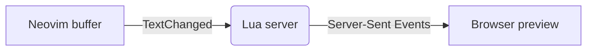

# mdlive demo

Edit this file with `:MdLive` running and watch the browser update.
Jump to the [math section](#math) or open the [guide](docs/guide.md#install)
in Neovim.

## Text

Some **bold**, *italic*, ~~strikethrough~~ and `inline code`.
Links are detected automatically: https://neovim.io

> A blockquote uses the colors of your Neovim theme.

> [!NOTE]
> GitHub alerts use your diagnostic colors.

> [!WARNING]
> Double-click any block to move the Neovim cursor there.

Emoji shortcodes work too :rocket: :tada:, and so do footnotes.[^offline]


## Lists

- [x] Live update while typing
- [x] Scroll sync with the cursor
- [ ] Something still to do

1. First
2. Second
   - Nested item

## Code

```lua
local function greet(name)
  -- say hello
  return ("Hello, %s!"):format(name)
end

print(greet("Neovim"), 42)
```

```python
def fib(n: int) -> int:
    return n if n < 2 else fib(n - 1) + fib(n - 2)
```

## Table

| Feature      | Status |
| ------------ | :----: |
| Live preview |   ✅   |
| Mermaid      |   ✅   |
| Math         |   ✅   |

## Math

Inline math: $e^{i\pi} + 1 = 0$.

$$
\int_{-\infty}^{\infty} e^{-x^2}\,dx = \sqrt{\pi}
$$

## Diagram



[^offline]: Every library is bundled, so the preview works offline.
